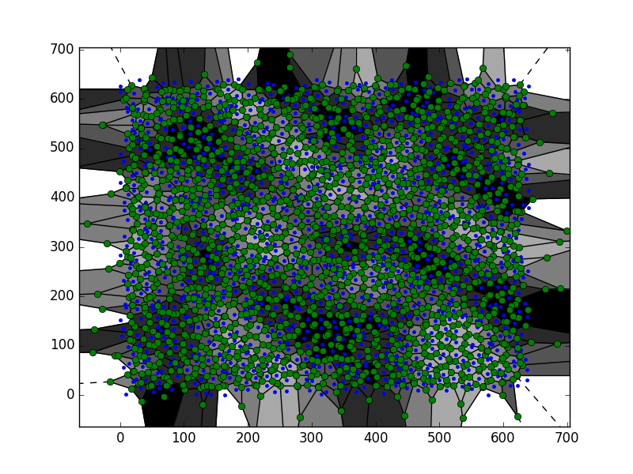
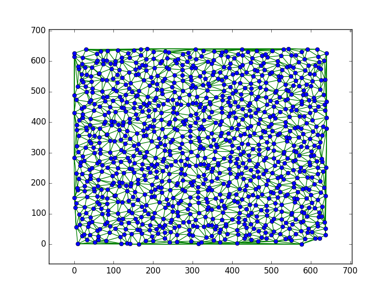

# worldmap generator

## installation

1. start a mongodb


    docker run -d -p 27017:27017 -p 28017:28017 -e AUTH=no --name mongodb tutum/mongodb

2. setup python stuff

    
    virtualenv -p python3 env
    source env/bin/activate
    pip install -r requirements.txt
    
3. use it.

the whose thing is intended to be used from python.

```
>>> from voronoi.voronoiworld import VoronoiWorld
>>> 
>>> w = VoronoiWorld('test')
>>> w.get_point_data(0,0)
'{"neighbors": [[2, -1], [-1, 0], [0, -1], [0, 1], [1, -1], [1, 0]], "biome": "temperate_deciduous_f
orest", "temperature": 3, "height": 2, "position_on_map": [3, 4], "shape": [[3.3461538461538463, -7.
038461538461538], [-3.078947368421052, 12.236842105263158], [18.517937219730943, 15.836322869955158]
, [23.175984752223634, 3.295425667090216], [23.128304821150856, 3.06298600311042], [13.0643564356435
64, -7.48019801980198]]}'
``` 

to get some image output, you can the use w.save_biome_map(0,0) to get an image for the tile (0, 0) saved to ./worldname_0_0.pgm

## what it does

world creation consists of two layers:

- creating a tile map which stores 
    - heightlevel
    - temperature 
    - (calculated out of height + temp) the biome
    - an offset (see next point)
    
    ... per pixel

- create a "voronoi map" with the data of the pixel map
    - scale up image by a factor (eg 10)
    - add the offset for each pixel to make it look natural
    - calculate neighbors for the created fields


heightmap:


temperaturemap:


created voronoi (regions):



created delaunay (neighbors):

