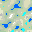

# worldmap generator

## installation

1. start a mongodb


    docker run -d -p 27017:27017 -p 28017:28017 -e AUTH=no --name mongodb tutum/mongodb

2. setup python stuff

    
    virtualenv -p python3 env
    source env/bin/activate
    pip install -r requirements.txt
    
3. use it.

the whose thing is intended to be used from python.

```
>>> from models.world import World
>>> w = World("testworld", 321, 64, 3)
>>> w.get_coord(0,0)
{'biome': 'temperate_deciduous_forest', 'height': 2, 'temperature': 3}
``` 

to get some image output, you can the use w.save_biome_map(0,0) to get an image for the tile (0, 0) saved to ./worldname_0_0.pgm

## what it does

generating a world means creating a height- and a temperaturemap. we use the noise package to create perlin noise for this.
out of height and temp we create a biome map (see constants.py for modifying)




heightmap:


temperaturemap:


