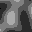

# worldmap generator

generate a worldmap which lives in in ram while the worldmap process is running.

has also some image output (which should be nice if you are human).


## howto (tl;dr)


```
    > python world_test.py --help
    usage: world_test.py [-h] [--savetiles] name seed x y
    
    positional arguments:
      name
      seed
      x
      y
    
    optional arguments:
      -h, --help   show this help message and exit
      --savetiles
```


generating a world means creating a height- and a temperaturemap.
out of this we create a biome map (see constants.py for modifying)


heightmap:


temperaturemap:




## usage as module

```
>>> from world.world import World
>>> w = World("testworld", 234, 128, 3, savetiles=False)  # name, seed, tilesize, octaves ("blobsize")
>>> w.get_coord(0,8)
{'biome': 'temperate_desert', 'height': 3, 'temperature': 1}
```

tiles, once created, are stored in ram. this may need work later, as worlds become bigger.
also, depending on the client, we may need to store corresponding images to show as a worldmap.
